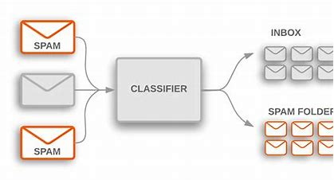

# Email Spam Classifier

## Overview
The **Email Spam Classifier** is a machine learning project designed to filter spam emails from legitimate messages. Using Natural Language Processing (NLP) techniques, the classifier identifies patterns in email text and determines whether an email should be classified as spam or not. This project demonstrates data preprocessing, feature extraction, model training, and evaluation to build an efficient spam detection system.

## Features
- **Preprocessing**: Cleans and tokenizes email text.
- **Feature Extraction**: Converts text into numerical features using TF-IDF or CountVectorizer.
- **Model Training**: Uses classification models like Naïve Bayes, Logistic Regression, or Random Forest.
- **Evaluation**: Measures accuracy, precision, recall, and F1-score.
- **Deployment**: Can be integrated into applications via Flask or FastAPI.

## Dataset
The dataset consists of labeled email messages with two categories:
- **Spam (1):** Unwanted, unsolicited messages.
- **Ham (0):** Legitimate emails.

## Workflow
1. **Data Collection:** Gather labeled email datasets.
2. **Preprocessing:** Remove stopwords, punctuation, and special characters.
3. **Feature Extraction:** Convert email text into numerical features.
4. **Model Selection & Training:** Train models such as Naïve Bayes, SVM, or Deep Learning models.
5. **Evaluation:** Assess the model's performance using accuracy and precision-recall metrics.
6. **Prediction:** Classify new emails as spam or ham.
7. **Deployment (Optional):** Deploy the trained model using Flask or Streamlit for real-time classification.

## Technologies Used
- **Programming Language:** Python
- **Libraries:** Pandas, NumPy, Scikit-learn, NLTK, Matplotlib, Flask (for deployment)
- **Machine Learning Algorithms:** Naïve Bayes, Logistic Regression, Random Forest
- 
## Usage
1. Train the model using the dataset.
2. Input an email message via the interface or command line.
3. The model predicts whether the email is spam or not.
4. Results are displayed with classification confidence.

## Evaluation Metrics
- **Accuracy**: Measures overall correctness.
- **Precision**: Identifies relevant spam detections.
- **Recall**: Captures all spam emails.
- **F1-Score**: Balances precision and recall.

## Future Improvements
- Enhance feature engineering for better accuracy.
- Implement deep learning-based spam detection.
- Deploy as a web application with user-friendly UI.

